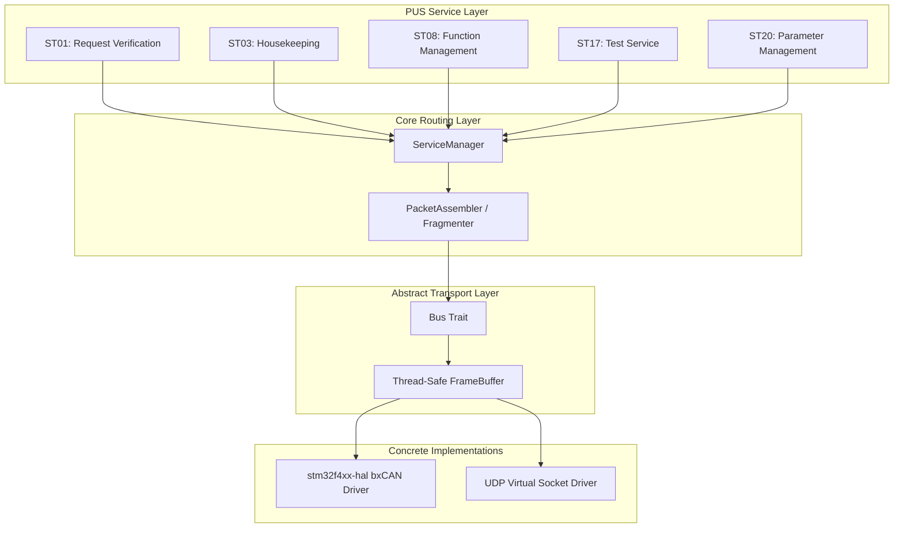
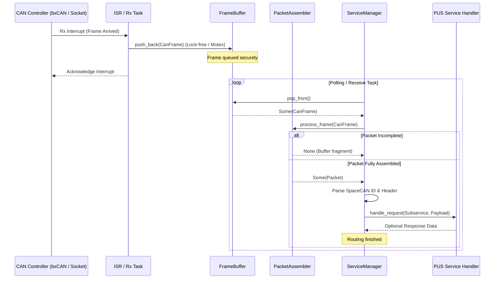

# Architecture Redesign: rust-spacecan

## 1. High-Level System Architecture

`rust-spacecan` utilizes a modular layered architecture, ensuring the core protocol logic remains completely isolated from hardware-specific registers.



## 2. Component Boundaries

The project is structured into three discrete crates with strict boundaries:

1. **`spacecan` (Library)**:
   - **Properties**: Strictly `#![no_std]`, no unconditional global allocators.
   - **Boundary**: Exposes the `Bus` trait for injection. Contains protocol parser, PUS service routers, and packet serialization logic.
2. **`spacecan-firmware` (Bare-Metal Binary)**:
   - **Properties**: `#![no_std]`, `#![no_main]`, target architecture `thumbv7em-none-eabihf`.
   - **Boundary**: Initializes hardware clocks, GPIOs, and the STM32F4 `bxcan` peripheral. Injects the bxCAN driver into `spacecan::SpaceCANProtocol`. Handles raw MCU interrupts.
3. **`spacecan-virtual` (Desktop Simulation)**:
   - **Properties**: Standard `std` compilation, targets development hosts (Windows, Linux, macOS).
   - **Boundary**: Spawns tokio runtime. Injects a UDP-based virtual loopback/multicast transport into the protocol engine. Offers a CLI interface for system testing.

## 3. Data Flow

### A. Telecommand (TC) Reception Pipeline


## 4. Failure Modes & Safety

| Failure Mode | Detection Mechanism | Mitigation Strategy |
| :--- | :--- | :--- |
| **Bus Buffer Overflow** | Check `FrameBuffer` capacity bounds on push. | Drop the oldest packet (embedded ring-buffer strategy) and set an error status flag in the heartbeat status byte. |
| **Heartbeat Timeout** | `NetworkManager` tracks `last_seen` timestamp per node. | Switch the selected active bus (arbitrate from Bus A to Bus B) and trigger a ST01 execution failure report if active operations fail. |
| **Packet Assembly Drift** | Timestamp tracking on packet assembler buffers. | Flush fragment buffers for a specific CAN ID if no packets are received within 3 seconds, avoiding memory leaks. |
| **Thread Race Conditions** | Prevented by Rust compiler. | Replace `UnsafeCell` with `critical-section` atomic locks for `no_std`, and standard `Mutex` / channels for virtual targets. |

## 5. Portability & Scalability Strategy

- **Hardware Decoupling**: The protocol communicates with the bus solely through the `Bus` trait:
  ```rust
  pub trait Bus: Send + Sync {
      fn send(&self, frame: &CanFrame) -> Result<(), CanFrameError>;
      fn receive(&self) -> Result<Option<CanFrame>, CanFrameError>;
  }
  ```
- **Virtualization over UDP**: Instead of raw SocketCAN (Linux-only), the mock transport uses standard UDP multicast sockets. This allows developers to spin up multi-node virtual spacecraft networks on Windows, Linux, or macOS.
- **Dynamic PUS Services**: `ServiceManager` uses a map interface to register service handlers dynamically, allowing teams to add new ECSS services without modifying core routing logic.
